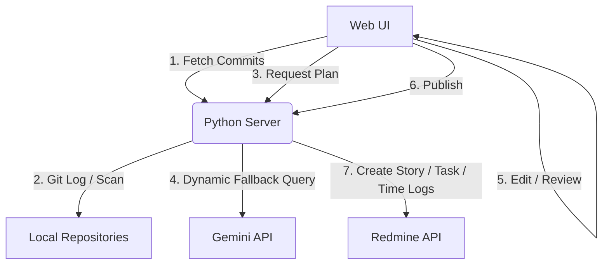

# 🚀 Redmine Worklog Automation Tool

A modern, lightweight, zero-dependency assistant to automate developer worklog planning and Redmine logging directly from local Git commit histories, powered by **Google Gemini AI**.

---

## ✨ Key Features

- 🤖 **AI-Assisted Worklog Planning**: Automatically aggregates commits from multiple workspace paths and groups them into logical User Stories and nested Tasks using Gemini.
- ⚡ **Multi-Model Fallback Loop**: Automatically detects rate-limit (`429 Too Many Requests`) or service availability errors on the Gemini API, priority-routing queries to available models (e.g. `gemini-2.5-flash`, `gemini-2.0-flash-lite`, `gemini-3.1-flash-lite`) until one succeeds.
- 📅 **Smart Date Calculations**: Automatically filters out weekends, holidays/leaves, and schedules appropriate workloads for half-days (4 hours instead of 8).
- 🕒 **Future Date Clamping**: Automatically detects and clamps any future log dates generated by the AI to today's date to avoid Redmine API `422 Unprocessable Entity` failures.
- ✏️ **Interactive Inline Editing**: Allows reviewing and manually editing Story subjects, Task descriptions, log hours, and comments directly in the browser before pushing.
- 🔒 **Secure Config Integration**: Zero hardcoded credentials in code; configuration and keys are loaded dynamically from environment variables or a local `.env` file.
- 🎨 **Premium Glassmorphic Interface**: Beautiful dark-themed frontend with Outfit typography, smooth CSS gradients, status logs, and micro-animations.

---

## 🛠️ Tech Stack & Architecture

- **Backend**: Python 3 (using standard libraries `http.server`, `urllib`, `subprocess`, `json`, `datetime`) — **zero external dependencies**.
- **Frontend**: Single-page modern HTML5, Vanilla JavaScript, and native CSS.



---

## 🚀 Setup & Installation

### 1. Configure the Environment
Clone the repository and copy the template environment configuration:
```bash
cp .env.example .env
```

Open `.env` and fill in your parameters:
```ini
PORT=8080
REDMINE_URL=https://pm.shauryatechnosoft.com
REDMINE_API_KEY=your_redmine_api_access_key
PROJECT_ID=8
GIT_AUTHOR_EMAIL=your_email@example.com
WORKSPACE_PATHS=["/path/to/ui", "/path/to/backend"]
GEMINI_API_KEY=your_gemini_api_key
```

### 2. Start the Server
Run the unbuffered Python server:
```bash
python3 -u server.py
```

Open your browser and navigate to:
```
http://localhost:8080
```

---

## 📖 How It Works

1. **Scraping**: The backend runs `git log` commands across all subdirectories of your configured workspace directories, filtering by your Git email address and date range.
2. **AI Distribution**: The commits are sent along with working dates and leaves configuration to Gemini. Gemini distributes these commits chronologically into structured User Stories and child Tasks.
3. **Review & Adjust**: In the UI board, you can adjust log hours, customize task names, and fine-tune log messages.
4. **Publish**: Clicking **Publish to Redmine** creates parent stories, child tasks, logs spent time on each date, and provides a button to close all created issues as `100% Done` once the work is verified.
